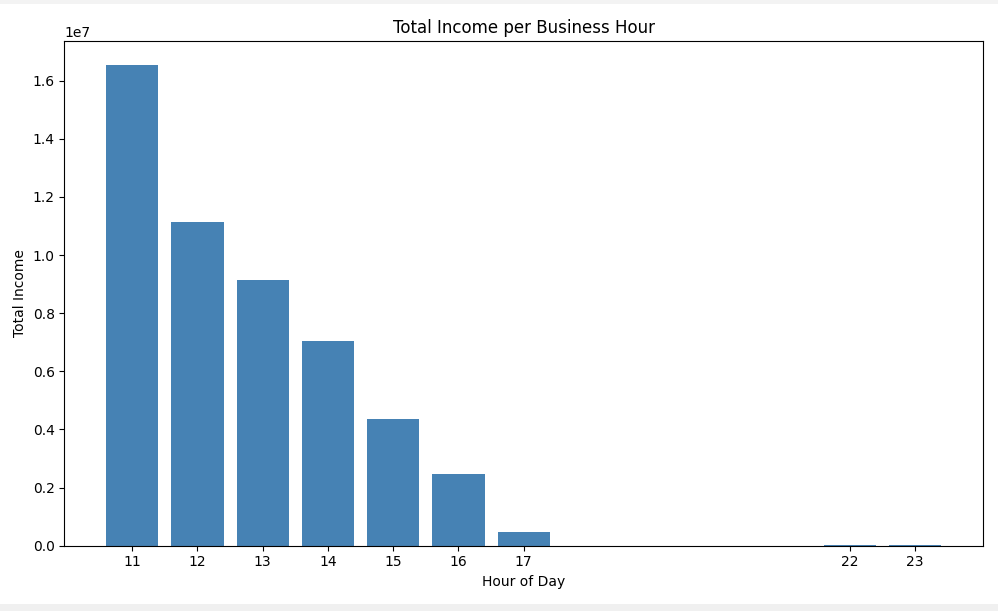
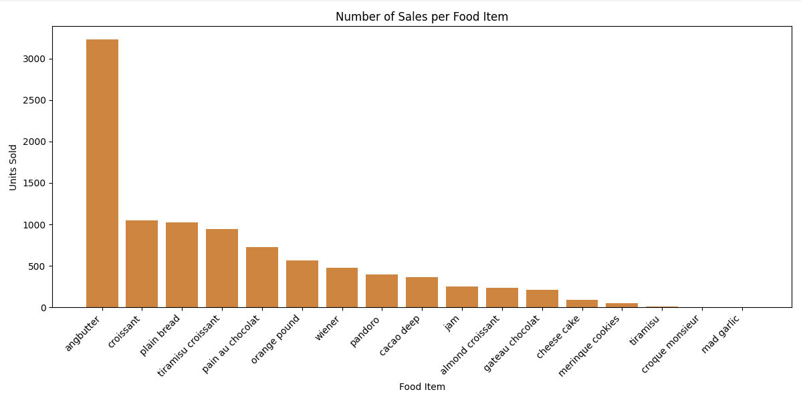
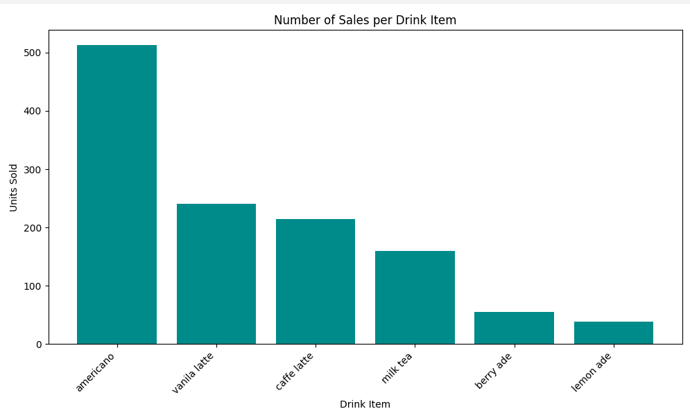
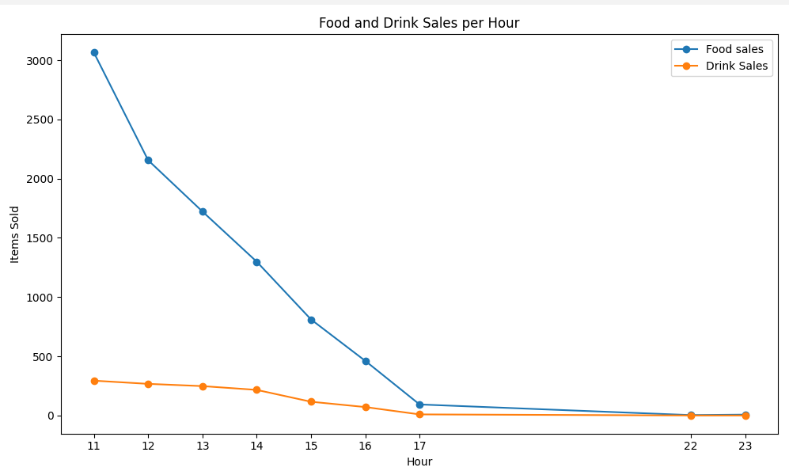
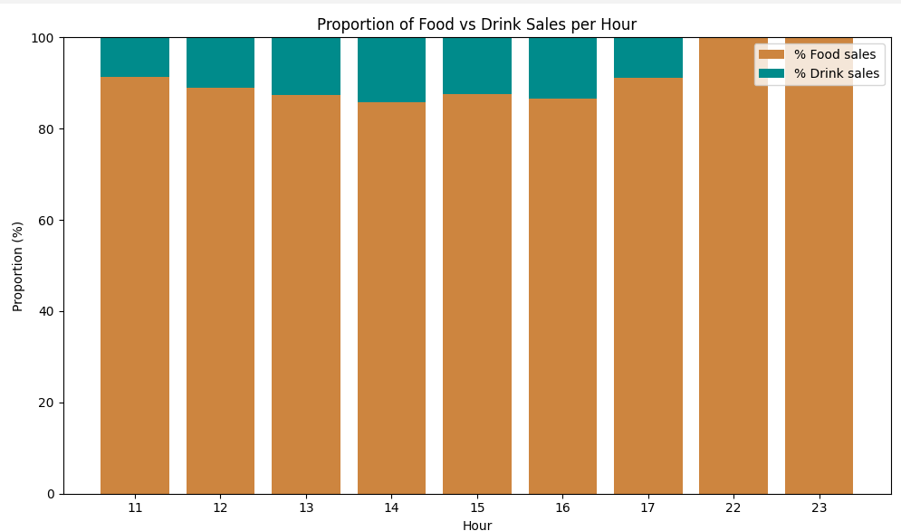

# Bakery Sales Analysis

Did an analysis on a dataset of a bakery that contained transaction data — used pandas to explore hourly income trends, daily trends, and product popularity.

## Overview

This project analyzes point-of-sale data to answer:
- What are the busiest hours of the day?
- How does income vary by day of the week?
- Which products sell the most?

## Tools Used

- **Python 3**
- **pandas**
- **matplotlib**
- **openpyxl**

## Data

The dataset contains transaction-level bakery sales records, with attributes such as date/time of purchase, hour, day of week, total amount, and individual menu items purchased. The raw data file is not included in this repository.

## Visualizations

<table style="width:100%; border-collapse:collapse;">
  <tr>
    <td align="center"> <b>Total income per business hour</b></td>
    <td align="center"> <b>Number of sales per food item</b></td>
  </tr>
  <tr>
    <td align="center"> <b>Number of sales per drink item</b></td>
    <td align="center"> <b>Food and drink sales per hour</b></td>
  </tr>
  <tr>
    <td colspan="2" align="center"> <b>Proportion of food vs drink sales per hour</b></td>
  </tr>
</table>
